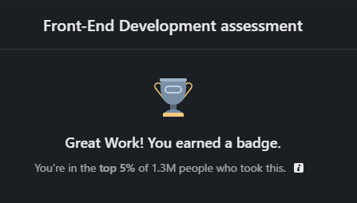
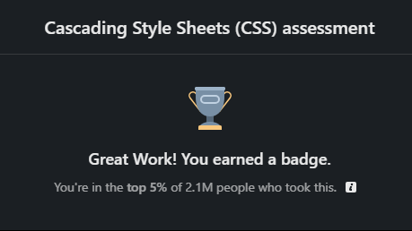

# 💫 About Me:

👋 **Greetings!**  
I'm Muhammad Kamran, a MERN Stack developer with expertise in front-end technologies. 
#
- 🌱 **I’m currently learning:**  
  NextJs MongoDB

- 💬 **Ask me about:**  
  JavaScript, React, Node.js, and any general coding questions.

- ⚡ **Fun fact:**  
   Book lover with Eclectic tastes📚!

## 🌐 Socials:

 

  
## 💻 Tech Stack:
            
  
## 📊 Badges:

<!--
**Liarhunyawrr/Liarhunyawrr** is a ✨ _special_ ✨ repository because its `README.md` (this file) appears on your GitHub profile.

Here are some ideas to get you started:

- 🔭 I’m currently working on ...
- 🌱 I’m currently learning ...
- 👯 I’m looking to collaborate on ...
- 🤔 I’m looking for help with ...
- 💬 Ask me about ...
- 📫 How to reach me: ...
- 😄 Pronouns: ...
- ⚡ Fun fact: ...
-->
